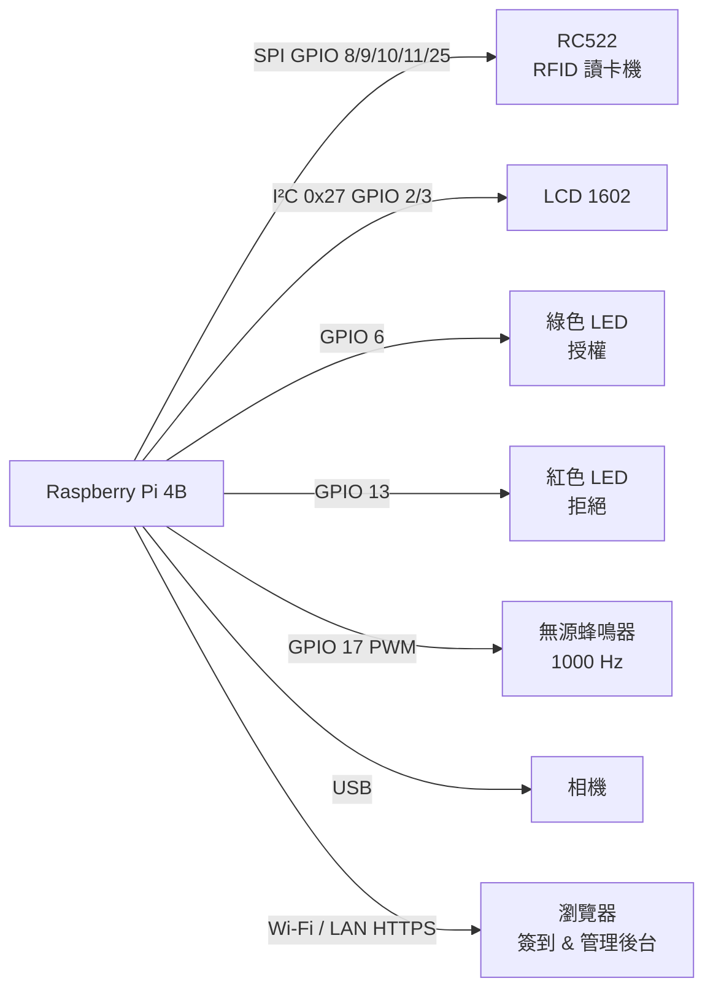
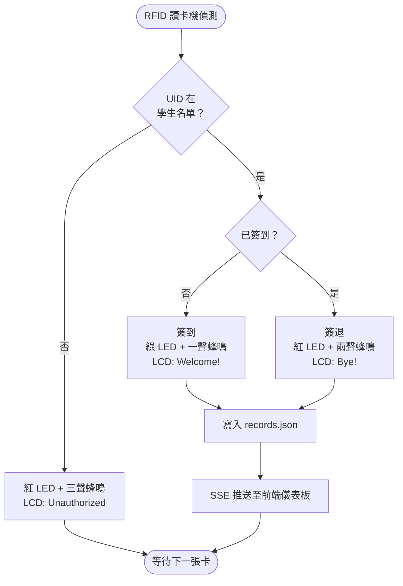
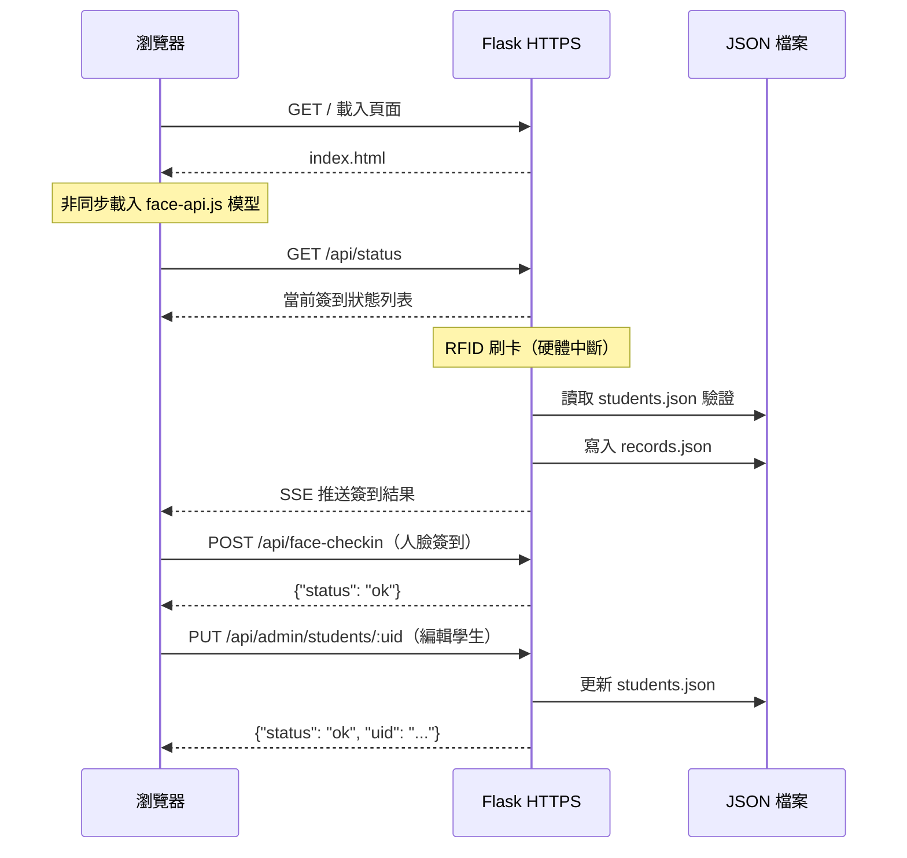
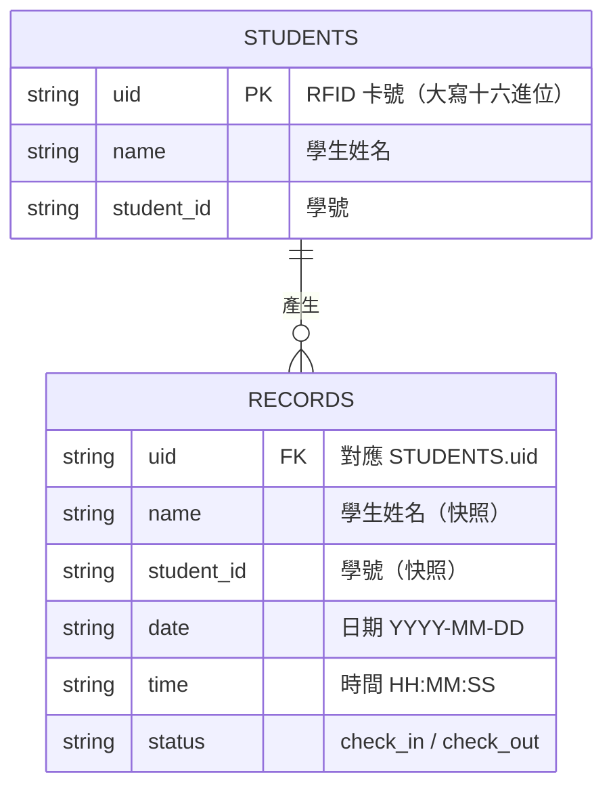

# 智慧 RFID 簽到系統

以 Raspberry Pi 為核心，結合 RFID 感應卡、人臉辨識與 Web 管理介面，實現自動化出勤簽到。

---

## 系統架構圖

### 硬體架構



### 系統流程圖



### 前後端互動流程



### 資料模型（ER 圖）



---

## 功能特色

- **RFID 簽到／簽退**：刷卡即可完成簽到，再刷一次簽退，自動記錄時間戳
- **人臉辨識驗證**（可選）：透過 face-api.js 在瀏覽器端完成，不需傳送影像至伺服器
- **LCD 1602 即時顯示**：簽到結果顯示於 I²C LCD 螢幕
- **LED + 蜂鳴器回饋**：綠燈/一聲=簽到成功，紅燈/兩聲=簽退，三聲=未授權
- **Web 管理後台**：新增／編輯／刪除學生，查看出勤紀錄，匯出 CSV
- **HTTPS 加密**：自簽憑證，確保 `getUserMedia` 相機權限正常運作

---

## 硬體需求

| 零件 | 規格 / 備註 |
|------|------------|
| Raspberry Pi | 4B（建議）或 3B+ |
| RFID 讀卡機 | RC522（SPI 介面） |
| LCD 螢幕 | 1602 + PCF8574 I²C 轉接板（位址 0x27） |
| LED × 2 | 綠色 GPIO 6、紅色 GPIO 13 |
| 蜂鳴器 | Keyes 無源蜂鳴器，GPIO 17（需 PWM） |
| 相機 | USB 相機 或 Pi Camera（人臉辨識用） |

### GPIO 腳位對應（BCM 編號）

```
RC522        →  SDA=8, SCK=11, MOSI=10, MISO=9, RST=25
LCD 1602     →  SDA=2, SCL=3（I²C）
綠 LED       →  GPIO 6
紅 LED       →  GPIO 13
蜂鳴器       →  GPIO 17
```

---

## 安裝與啟動

### 1. 系統依賴

```bash
sudo apt update
sudo apt install -y python3-pip python3-venv libatlas-base-dev i2c-tools
# 啟用 SPI 與 I²C
sudo raspi-config  # Interface Options → SPI / I2C → Enable
```

### 2. 建立虛擬環境並安裝套件

```bash
python3 -m venv ~/robin
source ~/robin/bin/activate
pip install flask mfrc522 RPi.GPIO RPLCD
```

### 3. 下載 face-api.js 模型

```bash
python3 download_models.py
```

模型會下載至 `static/models/`（已列入 `.gitignore`，不隨 repo 上傳）。

### 4. 產生 HTTPS 自簽憑證

```bash
openssl req -x509 -newkey rsa:2048 -keyout key.pem -out cert.pem -days 365 -nodes \
  -subj "/CN=raspberrypi.local"
```

### 5. 取得 RFID 卡的 UID

```bash
sudo ~/robin/bin/python scan_uid.py
```

將印出的 UID 填入 `students.json`（或透過 Web 管理後台新增）。

### 6. 啟動伺服器

```bash
sudo ~/robin/bin/python app_rfid.py
```

瀏覽器開啟 `https://<樹莓派IP>`，接受自簽憑證警告後即可使用。

---

## 管理後台

前往 `https://<樹莓派IP>/admin`，預設密碼：`admin123`

可透過環境變數修改密碼：

```bash
export ADMIN_PASSWORD=你的密碼
```

---

## 專案結構

```
.
├── app_rfid.py          # 主程式（需樹莓派硬體）
├── app_test.py          # 測試用（無硬體依賴）
├── scan_uid.py          # 掃描 RFID 卡 UID
├── download_models.py   # 下載 face-api.js 模型
├── templates/
│   └── index.html       # 前端（簽到頁 + 管理後台）
├── static/
│   ├── models/          # face-api.js 模型（需自行下載）
│   └── faces/           # 學生人臉照片（本地存放）
├── students.json        # 學生資料（本地存放，不上傳）
├── records.json         # 出勤紀錄（本地存放，不上傳）
├── cert.pem             # TLS 憑證（不上傳）
├── key.pem              # TLS 私鑰（不上傳）
└── logs/                # 系統日誌（不上傳）
```

---

## 技術架構

- **後端**：Python 3 + Flask，HTTPS（自簽憑證）
- **RFID**：mfrc522，MIFARE Classic Key A 驗證
- **人臉辨識**：face-api.js（ssdMobilenetv1 + FaceMatcher，閾值 0.55），純前端運算
- **LCD**：RPLCD 1.4.0，I²C PCF8574 擴充板
- **資料儲存**：JSON 檔案（students.json、records.json）

---

## 心得

這次專題從零開始建構一套完整的智慧簽到系統，過程中遇到不少挑戰，也學到許多課本上沒有的實務經驗。

**硬體整合的眉角**
RC522 RFID 讀卡機透過 SPI 連接，初期因為腳位接錯導致一直讀不到卡，後來用 `scan_uid.py` 逐步確認才找到問題。LCD 1602 的 I²C 位址也需要用 `i2cdetect` 工具確認，不能直接假設是 `0x27`。蜂鳴器部分踩了一個坑：Keyes 無源蜂鳴器（Passive Buzzer）無法用 `GPIO.output` 直接驅動，必須用 PWM 輸出固定頻率的方波才能發聲，這個差異在文件上幾乎沒有明確說明。

**瀏覽器安全限制**
`navigator.mediaDevices.getUserMedia` 在非 HTTPS 環境下會被瀏覽器封鎖，導致人臉辨識相機無法啟動。為此額外學習了如何用 OpenSSL 產生自簽憑證，讓 Flask 以 HTTPS 模式運行。在學校網路環境測試時也利用了 `chrome://flags` 的白名單機制繞過限制，了解到瀏覽器安全政策對 Web 應用開發的實際影響。

**前後端協作設計**
人臉辨識選擇在瀏覽器端（face-api.js）執行，避免影像傳輸帶來的隱私風險與網路延遲。這讓我體會到「在哪裡運算」是系統設計時需要權衡的決策，而不只是讓功能跑起來就好。

**整體收穫**
這個專題讓我將嵌入式系統、網路安全、前端開發與後端 API 設計整合在一個真實可用的產品中，比單純寫作業更能感受到各項技術的連結與限制。未來若要延伸，可考慮串接資料庫取代 JSON 儲存，或是加入 LINE Notify 即時通知功能。

---

## 注意事項

- `students.json`、`records.json`、人臉照片、憑證檔案均已列入 `.gitignore`，請勿手動上傳
- 首次存取時瀏覽器會顯示「您的連線不是私人連線」，點選「進階 → 繼續前往」即可
- 若在 HTTP 環境測試，可於 Chrome 開啟 `chrome://flags/#unsafely-treat-insecure-origin-as-secure` 將目標 IP 加入白名單
