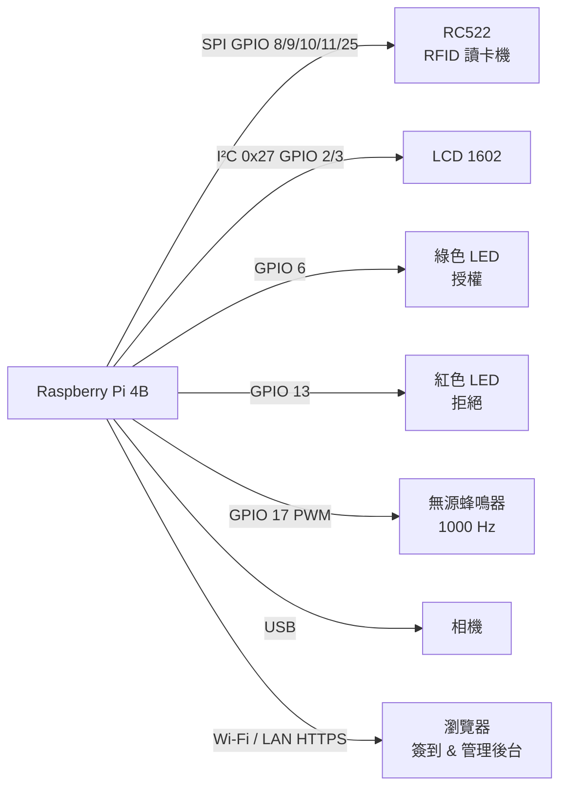
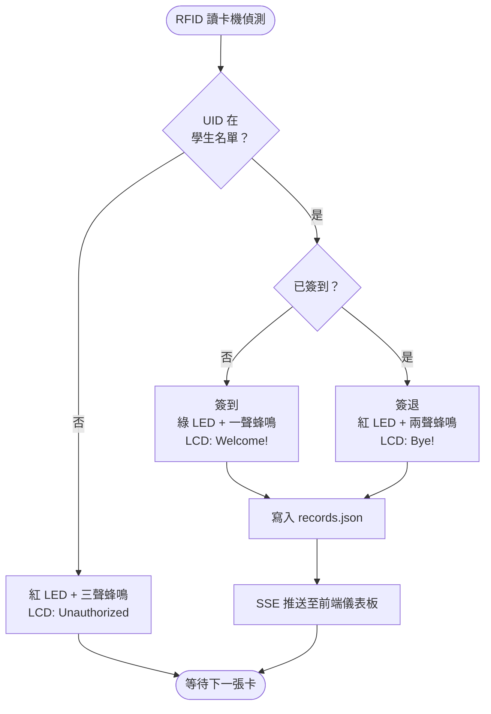
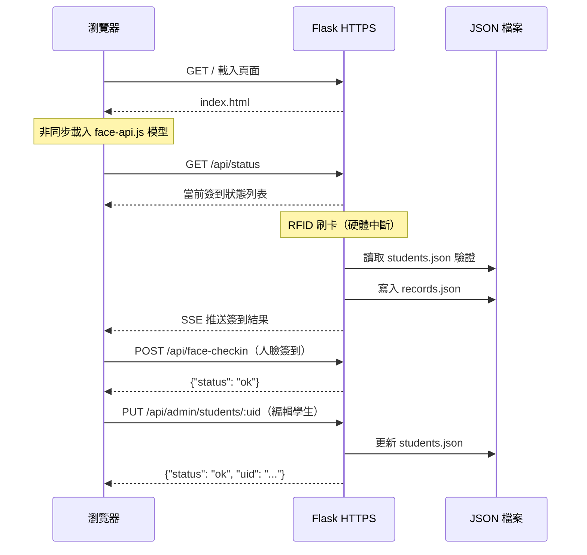
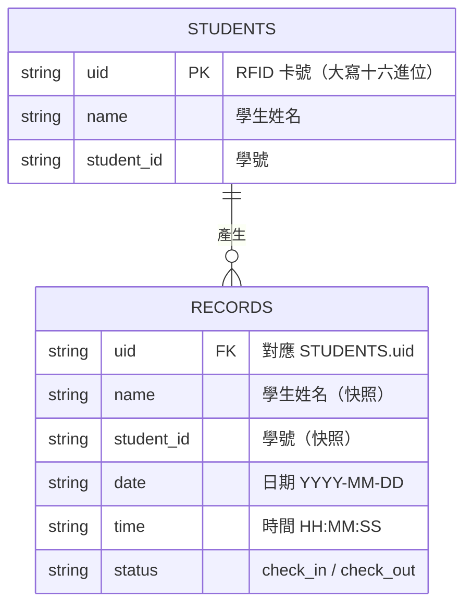

# 智慧 RFID 簽到系統 實驗報告

**課程名稱：** 嵌入式系統專題  
**組員：** 承曄（111432005）、泳翰（111432020）、凱筠（111534002）、宇宸（111432018）、晉綸（111432016）  
**日期：** 2026 年 5 月

---

## 一、實驗目的

本專題旨在設計並實作一套結合 **RFID 感應卡** 與 **人臉辨識** 的智慧出勤簽到系統，部署於 Raspberry Pi 單板電腦上，達成以下目標：

1. **RFID 簽到／簽退**：學生以 MIFARE 感應卡靠近 RC522 模組，系統自動辨識身份並記錄時間戳記，同時計算在場時間。
2. **人臉辨識簽到**：透過瀏覽器端 face-api.js，擷取使用者即時影像並與已登記人臉比對，提供無接觸式備援簽到方式。
3. **即時儀表板**：以 Flask 架設 Web 伺服器，提供視覺化介面顯示今日簽到人次、累計人次、未授權嘗試次數及 LCD 即時訊息。
4. **管理者後台**：提供密碼保護的管理介面，支援學生資料新增、編輯、刪除及人臉照片登記。
5. **硬體回饋**：LED 指示燈（綠色授權／紅色拒絕）、蜂鳴器音效、LCD 1602 顯示姓名與狀態，提供即時實體回饋。

---

## 二、電路圖

### 系統架構

```
┌─────────────────────────────────────────────────────┐
│                  Raspberry Pi 4                      │
│                                                      │
│  SPI ──────────────── RC522 RFID 讀卡機              │
│  I²C ──────────────── LCD 1602（I²C 位址 0x27）      │
│  GPIO 6  ──────────── 綠色 LED（授權）               │
│  GPIO 13 ──────────── 紅色 LED（拒絕）               │
│  GPIO 17 ──────────── 蜂鳴器（Keyes 無源，PWM 驅動） │
│                                                      │
│  Flask HTTPS Server ─── 區域網路 ─── 筆電／手機瀏覽器 │
└─────────────────────────────────────────────────────┘
```

### 腳位接線表

#### RC522 RFID 模組（SPI 介面）

| RC522 腳位 | Raspberry Pi 腳位 | BCM 編號  |
|-----------|-----------------|---------|
| 3.3V      | Pin 17          | 3.3V 電源 |
| GND       | Pin 20          | 接地      |
| MOSI      | Pin 19          | GPIO 10  |
| MISO      | Pin 21          | GPIO 9   |
| SCK       | Pin 23          | GPIO 11  |
| SDA (CS)  | Pin 24          | GPIO 8   |
| RST       | Pin 22          | GPIO 25  |
| IRQ       | 不接            | —        |

#### LCD 1602（I²C 介面，PCF8574 背板）

| LCD 腳位 | Raspberry Pi 腳位 | 說明          |
|---------|-----------------|-------------|
| VCC     | Pin 4           | 5V 電源       |
| GND     | Pin 6           | 接地          |
| SDA     | Pin 3           | GPIO 2（I²C） |
| SCL     | Pin 5           | GPIO 3（I²C） |

#### LED 與蜂鳴器

| 元件        | Raspberry Pi 腳位 | BCM 編號 | 備註                        |
|-----------|-----------------|---------|---------------------------|
| 綠色 LED   | Pin 31          | GPIO 6  | 限流電阻 100Ω 串接            |
| 紅色 LED   | Pin 33          | GPIO 13 | 限流電阻 100Ω 串接            |
| LED GND   | Pin 39          | 接地     | 兩顆 LED 共用                |
| 蜂鳴器 S   | Pin 11          | GPIO 17 | 被動式蜂鳴器（PWM 1000 Hz 固定音）|
| 蜂鳴器 GND | Pin 9           | 接地     | —                          |
| 蜂鳴器 VCC | Pin 2           | 5V 電源  | —                          |

---

### 硬體架構圖



### 系統流程圖



### 前後端互動流程



### 資料模型（ER 圖）



---

## 三、程式碼

### 3.1 RFID 讀取與簽到邏輯（`app_rfid.py`）

```python
def handle_checkin(student: dict, uid: str):
    now      = datetime.now()
    time_str = now.strftime("%H:%M:%S")
    date_str = now.strftime("%Y-%m-%d")

    _checked_in[uid] = {"student": student, "timestamp": now}
    lcd_show("Welcome!        ", time_str)
    threading.Thread(target=led_on_then_off, args=(LED_GREEN, 2.0), daemon=True).start()
    beep(1, 0.15)   # 簽到：短嗶一聲

    save_record({
        "name": student["name"], "student_id": student["student_id"],
        "date": date_str, "time": time_str, "status": "check_in", "uid": uid,
    })
    time.sleep(2.5)
    lcd_ready()


def handle_checkout(student: dict, uid: str):
    now          = datetime.now()
    time_str     = now.strftime("%H:%M:%S")
    date_str     = now.strftime("%Y-%m-%d")
    checkin_time = _checked_in.pop(uid)["timestamp"]

    delta        = now - checkin_time
    total_sec    = int(delta.total_seconds())
    duration_str = f"{total_sec//3600:02d}:{(total_sec%3600)//60:02d}:{total_sec%60:02d}"

    lcd_show("Goodbye!        ", f"Stay:{duration_str}")
    threading.Thread(target=led_on_then_off, args=(LED_GREEN, 2.0), daemon=True).start()
    beep(2, 0.12)   # 簽退：雙嗶

    save_record({
        "name": student["name"], "student_id": student["student_id"],
        "date": date_str, "time": time_str,
        "status": "check_out", "uid": uid, "duration": duration_str,
    })
    time.sleep(2.5)
    lcd_ready()


def handle_unauthorized(uid: str):
    lcd_show("Access Denied!  ", f"UID:{uid[:8]}")
    threading.Thread(target=led_on_then_off, args=(LED_RED, 2.0), daemon=True).start()
    beep(3, 0.12)   # 拒絕：三連嗶

    save_record({
        "name": "未知", "student_id": "N/A",
        "date": datetime.now().strftime("%Y-%m-%d"),
        "time": datetime.now().strftime("%H:%M:%S"),
        "status": "unauthorized", "uid": uid,
    })
    time.sleep(2.5)
    lcd_ready()


def rfid_loop():
    """背景執行緒：持續輪詢 RFID 讀卡機"""
    mfrc = MFRC522.MFRC522()
    lcd_ready()

    while True:
        status, _ = mfrc.MFRC522_Request(mfrc.PICC_REQIDL)
        if status != mfrc.MI_OK:
            time.sleep(0.1)
            continue

        status, uid_raw = mfrc.MFRC522_Anticoll()
        if status != mfrc.MI_OK:
            time.sleep(0.1)
            continue

        uid = "".join(f"{b:02X}" for b in uid_raw[:4])
        now = time.time()

        # 防重複刷卡（冷卻期間忽略同一張卡）
        if uid == _last_uid and (now - _last_time) < _COOLDOWN:
            time.sleep(0.1)
            continue
        _last_uid  = uid
        _last_time = now

        student = load_students().get(uid)
        if student is None:
            handle_unauthorized(uid)
            continue

        # Key A 磁區驗證
        mfrc.MFRC522_SelectTag(uid_raw)
        auth_status = mfrc.MFRC522_Auth(
            mfrc.PICC_AUTHENT1A, AUTH_BLOCK, KEY_A, uid_raw
        )
        mfrc.MFRC522_StopCrypto1()

        if auth_status != mfrc.MI_OK:
            handle_unauthorized(uid)
        elif uid in _checked_in:
            handle_checkout(student, uid)
        else:
            handle_checkin(student, uid)
```

### 3.2 LCD 顯示函式

```python
from RPLCD.i2c import CharLCD

try:
    mylcd = CharLCD(
        i2c_expander='PCF8574', address=0x27,
        port=1, cols=16, rows=2,
        dotsize=8, auto_linebreaks=False
    )
    logger.info("LCD 初始化成功（I2C 0x27）")
except Exception as e:
    mylcd = None
    logger.warning("LCD 初始化失敗，將跳過實體顯示：%s", e)

def lcd_show(line1: str, line2: str):
    global _lcd_state
    l1 = line1[:16].ljust(16)
    l2 = line2[:16].ljust(16)
    _lcd_state = {"line1": l1, "line2": l2}
    if mylcd is None:
        return
    try:
        mylcd.cursor_pos = (0, 0)
        mylcd.write_string(l1)
        mylcd.cursor_pos = (1, 0)
        mylcd.write_string(l2)
    except Exception as e:
        logger.warning("LCD 寫入失敗：%s", e)
```

### 3.3 被動式蜂鳴器（PWM 驅動）

```python
BUZZER_FREQ = 1000               # 固定音頻 1000 Hz
_buzzer_pwm = GPIO.PWM(BUZZER, BUZZER_FREQ)

def beep(times: int = 1, duration: float = 0.1, gap: float = 0.08):
    for i in range(times):
        _buzzer_pwm.start(50)    # 50% duty cycle → 發聲
        time.sleep(duration)
        _buzzer_pwm.stop()       # 停止發聲
        if times > 1 and i < times - 1:
            time.sleep(gap)
```

### 3.4 人臉辨識（`templates/index.html`，JavaScript）

```javascript
/* 建立 FaceMatcher：從伺服器載入已登記人臉 */
async function buildFaceMatcher() {
    const res      = await fetch('/api/students');
    const data     = await res.json();
    const students = data.students || {};

    const labeled = [];
    for (const [uid, info] of Object.entries(students)) {
        if (!info.has_face) continue;
        try {
            const img = await faceapi.fetchImage(
                `/static/faces/${uid}.jpg?t=${Date.now()}`
            );
            const det = await faceapi
                .detectSingleFace(img)
                .withFaceLandmarks()
                .withFaceDescriptor();
            if (det) {
                labeled.push(
                    new faceapi.LabeledFaceDescriptors(uid, [det.descriptor])
                );
            }
        } catch (e) {
            console.warn('無法載入人臉照片：', uid, e);
        }
    }
    if (labeled.length === 0) return null;
    return new faceapi.FaceMatcher(labeled, 0.55); // 距離門檻 0.55
}

/* 辨識當前影像並送出簽到請求 */
async function detectFace() {
    const statusEl = document.getElementById('face-status');
    const video    = document.getElementById('face-video');
    const canvas   = document.getElementById('face-canvas');
    const btn      = document.getElementById('btn-detect');

    btn.disabled = true;
    setStatus(statusEl, '🔍 偵測人臉中...', 'loading');

    const displaySize = { width: video.videoWidth, height: video.videoHeight };
    faceapi.matchDimensions(canvas, displaySize);

    const detection = await faceapi
        .detectSingleFace(video,
            new faceapi.SsdMobilenetv1Options({ minConfidence: 0.5 }))
        .withFaceLandmarks()
        .withFaceDescriptor();

    if (!detection) {
        setStatus(statusEl, '⚠️ 未偵測到人臉，請調整位置後再試', 'error');
        btn.disabled = false;
        return;
    }

    // 在畫面上繪製偵測框與特徵點
    const resized = faceapi.resizeResults(detection, displaySize);
    const ctx = canvas.getContext('2d');
    ctx.clearRect(0, 0, canvas.width, canvas.height);
    faceapi.draw.drawDetections(canvas, resized);
    faceapi.draw.drawFaceLandmarks(canvas, resized);

    // 瀏覽器端比對（不傳送影像至伺服器）
    const match = faceMatcher.findBestMatch(detection.descriptor);
    if (match.label === 'unknown') {
        setStatus(statusEl,
            `❌ 找不到符合的人臉（距離 ${match.distance.toFixed(2)}），請重新登記或調整角度`,
            'error');
        btn.disabled = false;
        return;
    }

    // 傳送 UID 至伺服器寫入簽到紀錄
    const res  = await fetch('/api/face-checkin', {
        method: 'POST',
        headers: { 'Content-Type': 'application/json' },
        body: JSON.stringify({ uid: match.label }),
    });
    const data = await res.json();
    if (data.status === 'ok') {
        const extra = data.duration ? `（在場 ${data.duration}）` : '';
        setStatus(statusEl,
            `✅ ${data.action === 'check_in' ? '簽到' : '簽退'}成功！${data.name} ${extra}`,
            'success');
        fetchData();
        setTimeout(closeFaceModal, 2500);
    } else {
        setStatus(statusEl, `❌ ${data.message || '伺服器錯誤，請重試'}`, 'error');
        btn.disabled = false;
    }
}
```

### 3.5 Flask 管理者 API（新增／編輯／刪除學生）

```python
# 新增學生
@app.route("/api/admin/students", methods=["POST"])
def api_admin_add_student():
    data = request.json or {}
    if data.get("password") != ADMIN_PASSWORD:
        return jsonify({"error": "密碼錯誤"}), 403
    uid  = data.get("uid", "").strip().upper()
    name = data.get("name", "").strip()
    sid  = data.get("student_id", "").strip()
    students = load_students()
    students[uid] = {"name": name, "student_id": sid}
    save_students(students)
    return jsonify({"status": "ok", "uid": uid})

# 編輯學生（支援 UID 變更，同步重新命名人臉照片）
@app.route("/api/admin/students/<uid>", methods=["PUT"])
def api_admin_update_student(uid):
    data    = request.json or {}
    if data.get("password") != ADMIN_PASSWORD:
        return jsonify({"error": "密碼錯誤"}), 403
    uid     = uid.upper()
    new_uid = data.get("new_uid", uid).strip().upper()
    name    = data.get("name", "").strip()
    sid     = data.get("student_id", "").strip()
    students = load_students()
    if new_uid != uid:
        old_face = os.path.join(FACES_DIR, f"{uid}.jpg")
        new_face = os.path.join(FACES_DIR, f"{new_uid}.jpg")
        if os.path.exists(old_face):
            os.rename(old_face, new_face)
        del students[uid]
    students[new_uid] = {"name": name, "student_id": sid}
    save_students(students)
    return jsonify({"status": "ok", "uid": new_uid})

# 刪除學生（同步移除人臉照片）
@app.route("/api/admin/students/<uid>", methods=["DELETE"])
def api_admin_delete_student(uid):
    data = request.json or {}
    if data.get("password") != ADMIN_PASSWORD:
        return jsonify({"error": "unauthorized"}), 401
    uid      = uid.upper()
    students = load_students()
    if uid not in students:
        return jsonify({"error": "not_found"}), 404
    del students[uid]
    save_students(students)
    face_path = os.path.join(FACES_DIR, f"{uid}.jpg")
    if os.path.exists(face_path):
        os.remove(face_path)
    return jsonify({"status": "ok"})
```

---

## 四、程式說明

### 4.1 整體架構

系統分為三層：

- **硬體層**：RC522 讀卡機透過 SPI 讀取 RFID UID；LED、蜂鳴器、LCD 提供即時實體回饋。
- **伺服器層**：Flask 以 HTTPS 在 Raspberry Pi 上運行，處理 RFID 輪詢執行緒與所有 REST API。學生資料與簽到紀錄分別儲存於 `students.json` 與 `records.json`。
- **前端層**：瀏覽器載入 `index.html`，每 2 秒輪詢 `/api/records` 更新儀表板，並使用 face-api.js 在瀏覽器端完成人臉比對（不需將影像傳送至伺服器）。

### 4.2 簽到／簽退切換邏輯

系統以 `_checked_in` 字典追蹤在場狀態（key 為 UID，value 為簽到時間）：

- **第一次刷卡**：UID 不在字典中 → 寫入簽到紀錄，將 UID 加入字典。
- **第二次刷卡**：UID 已在字典中 → 計算在場時間，寫入簽退紀錄，移除 UID。

RFID 與人臉辨識共用同一套邏輯，確保兩種方式可以交替使用。

### 4.3 人臉辨識流程

1. 開啟相機，載入三個 face-api.js 模型（ssdMobilenetv1、faceLandmark68、faceRecognition）。
2. 從 `/api/students` 取得有人臉照片的學生清單，對每張照片提取 128 維特徵向量，建立 `FaceMatcher`（距離門檻 0.55）。
3. 使用者點擊「開始辨識」，對當前影格提取特徵向量並與 `FaceMatcher` 比對。
4. 比對成功後將 UID 送至 `/api/face-checkin`，由伺服器寫入紀錄。

### 4.4 管理者後台

管理者透過密碼（預設 `admin123`，可由環境變數 `ADMIN_PASSWORD` 覆寫）登入後台，可執行：

- 查看所有授權學生及人臉登記狀態
- 新增、編輯（含 UID 變更）、刪除學生
- 為現有學生拍攝並上傳人臉照片

### 4.5 HTTPS 與相機存取

`getUserMedia` 需在安全情境（HTTPS 或 localhost）下才能存取相機。系統使用 OpenSSL 自簽憑證以 HTTPS 啟動，或於測試時在 Chrome 旗標頁面將 HTTP 位址加入安全白名單：

```
chrome://flags/#unsafely-treat-insecure-origin-as-secure
```

---

## 五、實驗照片／影片

> 📷 請於此處插入實際拍攝的照片或影片連結

| 項目           | 說明                              |
|--------------|----------------------------------|
| 硬體接線全景   | Raspberry Pi 與各模組實際接線照片   |
| RFID 刷卡示意  | 感應卡靠近讀卡機，LCD 顯示簽到姓名  |
| 儀表板畫面     | 瀏覽器即時簽到紀錄頁面截圖          |
| 人臉辨識截圖   | 瀏覽器鏡頭畫面與辨識框截圖          |
| 管理者面板截圖 | 學生清單與編輯功能截圖              |

---

## 六、心得

> 請各組員填寫個人心得

**承曄：**

**泳翰：**

**凱筠：**

**宇宸：**

**晉綸：**

---

## 七、其他（補充、參考資料）

### 補充說明

**被動式蜂鳴器注意事項**

Keyes 無源蜂鳴器屬被動式，無法直接以 `GPIO.output(HIGH)` 驅動，必須使用 PWM 方波。本系統固定使用 1000 Hz、50% duty cycle，音調單一，如需改變音高可調整 `BUZZER_FREQ` 數值。

**模型下載**

face-api.js 模型需預先下載至 `static/models/`，可執行：

```bash
python download_models.py
```

**服務啟動指令**

```bash
# 樹莓派（虛擬環境 + root，HTTPS port 443）
sudo /home/lee/robin/bin/python app_rfid.py

# 本機測試（無硬體）
python app_test.py
```

### 參考資料

1. **RPLCD 函式庫文件**  
   https://rplcd.readthedocs.io/en/stable/

2. **mfrc522-python（RC522 Python 驅動）**  
   https://github.com/ondryaso/pi-rc522

3. **face-api.js 官方文件**  
   https://github.com/justadudewhohacks/face-api.js

4. **Flask 官方文件**  
   https://flask.palletsprojects.com/

5. **Raspberry Pi GPIO 文件**  
   https://www.raspberrypi.com/documentation/computers/raspberry-pi.html

6. **Chrome 旗標：不安全來源視為安全**  
   `chrome://flags/#unsafely-treat-insecure-origin-as-secure`
